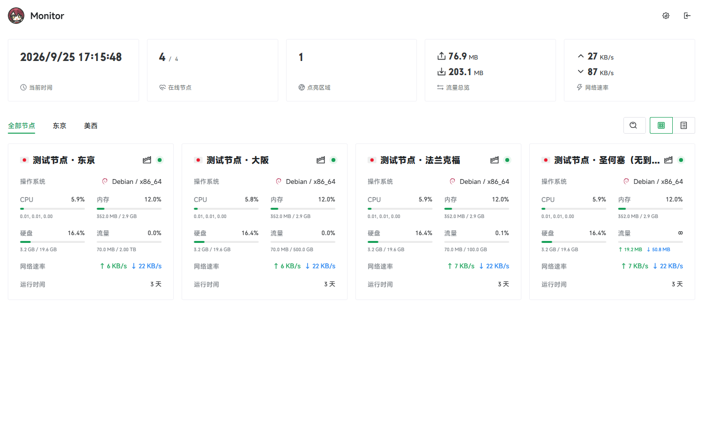

# Monitor Naive



将 [lyimoexiao/komari-theme-naive](https://github.com/lyimoexiao/komari-theme-naive) 移植到 [极简探针 Monitor](https://github.com/monitor-probe/monitor) 的主题，取名 **Monitor Naive**。基于原版 v1.1.2 的 Vue 源码、组件、样式与资源，数据改由 Monitor 的 REST / WebSocket 接口提供，不需要 Komari 服务器。

当前版本 1.0.1，保留原项目 MIT 许可与作者署名；移植与适配 by akanotanin。主题的内部标识保持 `naive`（安装目录名与配置键）。

## 主要功能

- **卡片与列表双视图**：卡片支持 compact / comfortable / spacious 三种密度，列表视图的显示列、列宽、行高、内边距都可配置；窄屏自动单列。
- **分区与状态**：在线 / 离线状态、地区旗帜、系统与内核、运行时间、CPU / 内存 / 磁盘 / 流量进度条，卡片与列表共用同一套格式化规则。
- **流量**：进度条按 Hub 的流量上限与统计口径计算，上下行速率与周期流量分色显示。
- **节点详情**：硬件、系统、存储信息卡片，以及 CPU / 内存 / 交换 / 负载 / 磁盘 / 网络 / 进程 / 连接 多标签图表，支持实时与历史切换。
- **延迟图表**：展示 Hub 的 Ping 任务线路，含延迟曲线与丢包统计。
- **主题外观**：亮色 / 暗色 / 跟随系统，亮暗两套主色调、字体、圆角、页面宽度、卡片进度条布局均可配置。
- **自定义背景**：图片或视频背景，背景模糊、卡片毛玻璃半径、遮罩透明度独立可调。
- **公告与备案**：Markdown 公告（含标题与类型）、ICP 与公安备案号。

## 更新

### 1.0.3

- 去掉页脚署名栏（Powered by / Theme by），页脚只在启用备案号时出现。
- 卡片与列表不再显示「剩余 N 天」与价格标签。
- 列表视图默认列把「标签」换成「网络速率」（↑ / ↓ 两行显示）。

### 1.0.2

- 仓库地址改为 `monitor-theme-naive`，主题清单里的更新地址同步指向新地址。

### 1.0.1

- 主题改名为 **Monitor Naive**（原「Naive · 极简探针」），浏览器标题与页脚署名同步更新。
- 仓库更名，主题清单里的更新地址指向新仓库。

### 1.0.0

- 首次发布：把 Komari 主题 Naive（v1.1.2）移植到极简探针 Monitor 1.3.0。
- 新增 `src/monitor/` 适配层（传输、数据映射、主题配置三个边界），原主题的组件、store、样式保持原样。
- `theme.json` 转换为主题清单格式，原版的 68 项设置全部保留，改由 Hub 的主题设置界面管理。
- 移除主题内的登录弹窗与 Komari 后台相关文件，登录入口改为跳转 `/admin/`。

## 与原版的差异

原主题依赖 Komari 的 RPC2 接口，其中一部分数据极简探针并不提供。这些能力**直接留空，不用当前值或累计值填充**：

| 原版功能 | 在极简探针上的表现 |
| --- | --- |
| 节点 IP、主机名、备注、标签 | 公开接口不下发，卡片与列表不显示 |
| GPU 型号与 GPU 图表 | 不下发，相关项留空 |
| 温度图表 | Agent 不上报温度，留空 |
| 交换、负载、进程、连接数的历史曲线 | Hub 只保存 CPU、内存、磁盘、上下行速率与 Ping 的历史；这些标签在实时视图里用当前值展示，没有曲线 |

其余差异：

- **实时图表粒度**：Hub 的采样是 1 分钟一桶。实时视图以最近 1 分钟粒度的历史为骨架，并在末端追加一条 Hub 当前采样，因此右端会随刷新跳动。
- **流量口径**：进度条与上下行数字使用**本计费周期**的流量，与 Hub 的流量上限同一口径；生命周期累计流量只在后台可见。
- **主题设置存在 Hub**：配置写入 `GET/PUT /api/themes/naive/config`，在后台「主题 → 主题设置」里修改，换设备或重装主题都不会丢；主题本身不再自带设置面板。
- **登录**：原版的主题内登录弹窗已移除。未登录时的登录按钮、以及站点未开放状态页时，统一跳转到极简探针的 `/admin/`。
- **页脚**：默认不显示。只有在启用备案号时，页脚才出现并显示 ICP / 公安备案信息。

## 安装

需要极简探针 **1.3.0 或更高版本**（主题配置接口自该版本提供）。

在后台「主题」→「上传主题包」，选择 [Releases](https://github.com/akanotanin/monitor-theme-naive/releases) 中的 `theme.tar.gz` 并启用。

## 数据映射

主题的组件与 store 一行未改，全部沿用原版对 Komari 数据结构的读取方式；适配层放在 `src/monitor/`，把接口调用翻译到极简探针：

| 主题调用的方法 | 极简探针接口 |
| --- | --- |
| `rpc.ping` | `GET /api/nodes` |
| `common:getNodes` | `GET /api/nodes` |
| `common:getNodesLatestStatus` | `GET /api/nodes`（含实时指标）与 `GET /api/ws` |
| `common:getNodeRecentStatus` | `GET /api/nodes/{id}/metrics?hours=1&points=60` + 当前采样 |
| `common:getRecords`（负载） | `GET /api/nodes/{id}/metrics?series=metrics` |
| `public:getPingRecords` | `GET /api/nodes/{id}/metrics?series=ping` |
| `public:getPublicSettings`、`public:getMe` | `GET /api/me` + `GET /api/themes/naive/config` |
| 其他方法 | 返回 `-32601`，界面显示为空而不是假数据 |

字段映射要点：

- `region` 由 `country`（ISO 3166-1 alpha-2）转成主题使用的旗帜 emoji，无法识别时留空。
- `billing_cycle` 由文案（`yearly`、`monthly`…）换算成天数，与原版的天数语义一致。
- `expired_at` 同时带上 Hub 下发的 `expires_in`（日历日），避免访客时区不同导致今天到期的节点提前显示「已过期」。
- `net_total_up/down` 取本计费周期流量，`traffic_limit_type` 取 `traffic_mode`，`weight` 取 `sort`。
- 历史记录的 `swap`、`load`、`temp`、`process` 等字段保持缺省（图表显示空档），不使用当前值冒充历史。

<details>
<summary>源码结构</summary>

```
src/monitor/types.ts      极简探针接口的数据结构
src/monitor/transport.ts  请求、快照缓存、历史窗口、方法名翻译、/api/ws 订阅
src/monitor/mapping.ts    Monitor 节点 → Komari Client / NodeStatus
src/monitor/config.ts     主题配置的读取与默认值合并
```

`src/utils/rpc.ts`、`src/utils/api.ts`、`src/utils/init.ts` 保持原有对外接口（`getSharedRpc()`、`getSharedApi()`、`initApp()`），内部改为调用上述适配层，因此 store 与组件无需改动。

</details>

## 开发

需要 Node.js 24+ 与 pnpm：

```bash
pnpm install
pnpm dev        # 开发服务器，/api 默认代理到 127.0.0.1:28080
pnpm build      # 类型检查并构建
pnpm lint
pnpm package    # 生成 release/theme.tar.gz
```

把请求代理到已开放状态页的现成 Hub：

```bash
MONITOR_HUB=https://hub.example.com pnpm dev
```

`preview.png` 是 1440×900 的首页截图，使用演示数据；重新截图时不要记录真实访客信息。

发布新版本：把 `theme.json` 与 `package.json` 的版本号改成同一个版本，推送 `x.y.z` 格式的 tag，GitHub Actions 会自动构建并创建带 `theme.tar.gz` 的 Release。

## 许可

MIT，沿用原主题许可。原主题作者 [lyimoexiao](https://github.com/lyimoexiao)，设计约定见 `DESIGN.md`。
